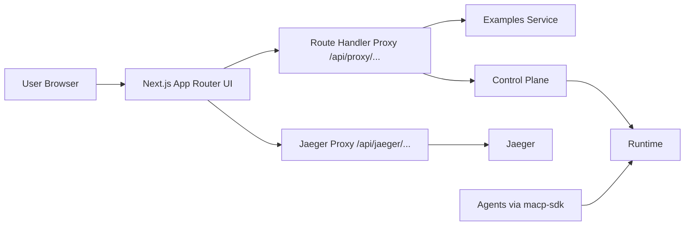

# Architecture

## Goal

Build a MACP UI that behaves like an execution operations console:

- orchestration launchpad
- live run monitor
- agent debugger
- logs and traces explorer
- historical analytics surface

## High-level architecture



Under the observer-only Control Plane model, agents emit envelopes (messages, signals, context updates) directly to the runtime via `macp-sdk-python` / `macp-sdk-typescript` rather than through CP HTTP endpoints. The UI reads lifecycle, state, and events from CP; it never originates agent traffic.

## Upstream services

This document describes the **UI** architecture. The upstream services have their own
architecture docs, referenced rather than duplicated here:

| Service | Canonical architecture doc |
|---|---|
| Examples Service | [`examples-service/docs/architecture.md`](https://github.com/multiagentcoordinationprotocol/examples-service/blob/main/docs/architecture.md) |
| Control Plane | [`control-plane/docs/ARCHITECTURE.md`](https://github.com/multiagentcoordinationprotocol/control-plane/blob/main/docs/ARCHITECTURE.md) |
| Runtime | [`runtime/docs/architecture.md`](https://github.com/multiagentcoordinationprotocol/runtime/blob/main/docs/architecture.md) |
| Python SDK (agent framework) | [`python-sdk/docs/architecture.md`](https://github.com/multiagentcoordinationprotocol/python-sdk/blob/main/docs/architecture.md) · [`guides/agent-framework.md`](https://github.com/multiagentcoordinationprotocol/python-sdk/blob/main/docs/guides/agent-framework.md) |
| TypeScript SDK (agent framework) | [`typescript-sdk/docs/index.md`](https://github.com/multiagentcoordinationprotocol/typescript-sdk/blob/main/docs/index.md) · [`guides/agent-framework.md`](https://github.com/multiagentcoordinationprotocol/typescript-sdk/blob/main/docs/guides/agent-framework.md) |

For the endpoint surface the UI actually consumes, see [`api-integration.md`](./api-integration.md)
and [`backend-repo-notes.md`](./backend-repo-notes.md).

## Front-end layers

### 1. App Router pages

The `app/` directory contains route-driven product surfaces:

- dashboard
- scenarios
- runs (history, live workbench, new-run launch)
- agents
- logs
- traces
- observability
- modes (runtime mode registry browser)
- policies (runtime policy registry browser, RFC-MACP-0012)
- settings

### 2. Data access layer

Located in `lib/api/`.

- `fetcher.ts` wraps proxy requests and exposes the typed `ApiError` class (with `isNotFound` getter for 404 discrimination).
- `client.ts` exposes typed UI-facing functions (~1180 lines) covering packs, scenarios, launch, runs, state, events, streaming, metrics, traces, artifacts, audit, webhooks, runtime metadata, runtime policies, batch ops, and admin. See [`api-integration.md § Client-side integration functions`](./api-integration.md#client-side-integration-functions) for the full inventory.
- Functions switch between demo-mode mocks and real proxy-backed requests.
- Includes response normalization layers that reconcile backend shapes with UI types:
  - `normalizeRun()` — unwraps paginated responses and nests flat `sourceKind`/`sourceRef` into `source: { kind, ref }`. `archivedAt` is passed through from CP directly (the legacy tag-synthesis bridge is gone).
  - `normalizeEvent()` — nests flat `sourceKind`/`sourceName`/`subjectKind`/`subjectId`/`rawType` fields into `source` and `subject` objects. Applied by `getRunEvents`, `listEvents`, and the SSE `canonical_event` handler.
  - `validateRun` maps `valid && errors.length === 0` → `ok` for the UI.
  - `cancelRun` and `archiveRun` extract `{ ok, runId, status | archived }` envelopes from CP's full run record responses.
  - Cross-run `listEvents` falls back to per-run fan-out when CP lacks the `/events` endpoint and caches the decision for the browser session.

### 3. Demo-mode data layer

Located in `lib/data/mock-data.ts` (~2000 lines).

Contains:

- packs
- scenarios
- launch schemas
- compiled execution requests
- runs
- run states
- events
- metrics
- traces
- artifacts
- audit logs
- webhook subscriptions
- chart series

### 4. Real-time state layer

Located in `lib/hooks/use-live-run.ts`.

Responsibilities:

- subscribe to live SSE stream
- track connection state
- merge incoming canonical events
- update run-state projection
- simulate stream progression in demo mode

### 5. Preferences layer

Located in `lib/stores/preferences-store.ts`.

Persisted UI settings:

- theme
- demo mode toggle
- auto-follow active node
- critical-path animation
- parallel branch visibility
- replay speed
- log density

## Key UI components

### Layout

- `AppShell`
- `Sidebar`
- `Topbar`
- `CommandPalette`

### Run experience

- `RunWorkbench`
- `ExecutionGraph`
- `NodeInspector`
- `LiveEventFeed`
- `SignalRail`
- `DecisionPanel`
- `RunOverviewCard`

### Catalog / analytics

- `ScenarioCard`
- `AgentCard`
- `RunsTable`
- `LineChartCard`
- `BarChartCard`

## Proxy / BFF model

The browser only calls:

```text
/api/proxy/example/...
/api/proxy/control-plane/...
/api/jaeger/...                 # optional, trace-detail deep-dives only
```

The generic proxy handler (`app/api/proxy/[service]/[...path]/route.ts`):

- maps `example` and `control-plane` to upstream base URLs
- forwards method, headers (minus `host` / `connection` / `content-length`), query string, and body
- injects auth when configured (`x-api-key` for Examples Service, `authorization: Bearer` for Control Plane)
- strips `content-encoding` on the response and streams the body unchanged
- appends `x-macp-ui-proxy: <service>` to every response for observability

The Jaeger proxy (`app/api/jaeger/[...path]/route.ts`) forwards GETs to `${JAEGER_BASE_URL}/api/*` and returns `502` when Jaeger is unreachable, so the UI degrades gracefully.

`lib/server/integrations.ts` resolves the base URLs and throws in production when they are missing; empty auth tokens log a warning but do not block the request.

## Product flows

### Scenario launch flow

1. list packs
2. list scenarios for selected pack
3. load launch schema
4. edit defaults
5. compile launch request
6. optionally validate request
7. submit request to Control Plane
8. redirect to live run workbench

### Live execution flow

1. fetch initial run record and state
2. open SSE stream
3. render graph
4. append canonical events
5. update node inspector and signal rail
6. show final decision once emitted

### Historical analysis flow

1. list runs
2. open run detail
3. inspect traces/artifacts/logs
4. compare with another run
5. review observability surfaces for regression analysis

## Extension points

Easy additions later:

- RBAC-aware route guards
- annotation/comments on runs
- prompt/policy version diffing (payload structural diff already ships; this would layer on top)
- alerting / threshold-based notifications on metric surfaces
