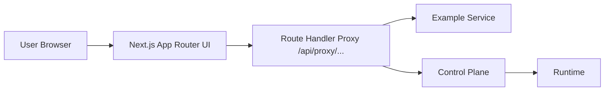

# Architecture

## Goal

Build a MACP UI that behaves like an execution operations console:

- orchestration launchpad
- live run monitor
- agent debugger
- logs and traces explorer
- historical analytics surface

## High-level architecture



## Front-end layers

### 1. App Router pages

The `app/` directory contains route-driven product surfaces:

- dashboard
- scenarios
- runs
- agents
- logs
- traces
- observability
- settings

### 2. Data access layer

Located in `lib/api/`.

- `fetcher.ts` wraps proxy requests
- `client.ts` exposes typed UI-facing functions
- functions switch between demo-mode mocks and real proxy-backed requests

### 3. Demo-mode data layer

Located in `lib/data/mock-data.ts`.

Contains:

- packs
- scenarios
- launch schemas
- compiled execution requests
- runs
- run states
- events
- metrics
- traces
- artifacts
- audit logs
- webhook subscriptions
- chart series

### 4. Real-time state layer

Located in `lib/hooks/use-live-run.ts`.

Responsibilities:

- subscribe to live SSE stream
- track connection state
- merge incoming canonical events
- update run-state projection
- simulate stream progression in demo mode

### 5. Preferences layer

Located in `lib/stores/preferences-store.ts`.

Persisted UI settings:

- theme
- demo mode toggle
- auto-follow active node
- critical-path animation
- parallel branch visibility
- replay speed
- log density

## Key UI components

### Layout

- `AppShell`
- `Sidebar`
- `Topbar`
- `CommandPalette`

### Run experience

- `RunWorkbench`
- `ExecutionGraph`
- `NodeInspector`
- `LiveEventFeed`
- `SignalRail`
- `DecisionPanel`
- `RunOverviewCard`

### Catalog / analytics

- `ScenarioCard`
- `AgentCard`
- `RunsTable`
- `LineChartCard`
- `BarChartCard`

## Proxy / BFF model

The browser only calls:

```text
/api/proxy/example/...
/api/proxy/control-plane/...
```

The route handler:

- maps `example` and `control-plane` to upstream base URLs
- forwards method, headers, and body
- injects auth when configured
- keeps secrets server-side

## Product flows

### Scenario launch flow

1. list packs
2. list scenarios for selected pack
3. load launch schema
4. edit defaults
5. compile launch request
6. optionally validate request
7. submit request to Control Plane
8. redirect to live run workbench

### Live execution flow

1. fetch initial run record and state
2. open SSE stream
3. render graph
4. append canonical events
5. update node inspector and signal rail
6. show final decision once emitted

### Historical analysis flow

1. list runs
2. open run detail
3. inspect traces/artifacts/logs
4. compare with another run
5. review observability surfaces for regression analysis

## Extension points

Easy additions later:

- RBAC-aware route guards
- OTEL trace deep-linking
- richer replay timeline scrubbing
- saved launch presets
- annotation/comments on runs
- diff viewer for prompt or policy versions
