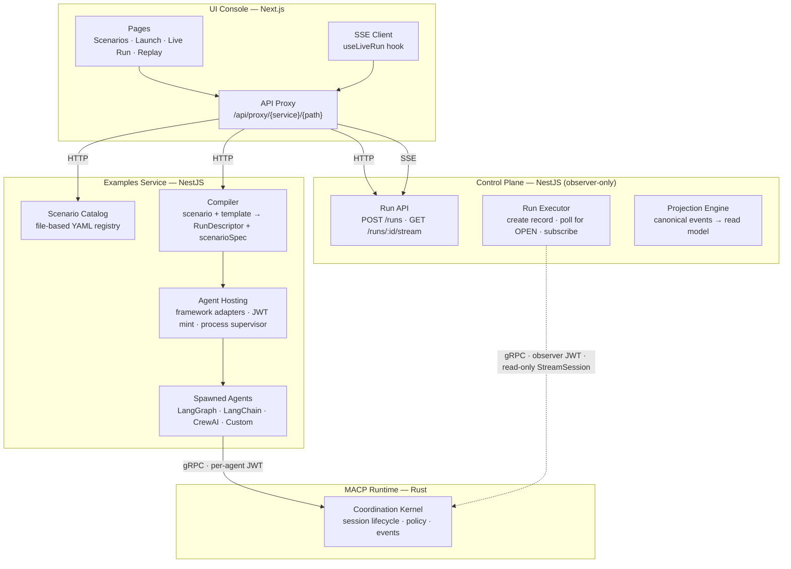
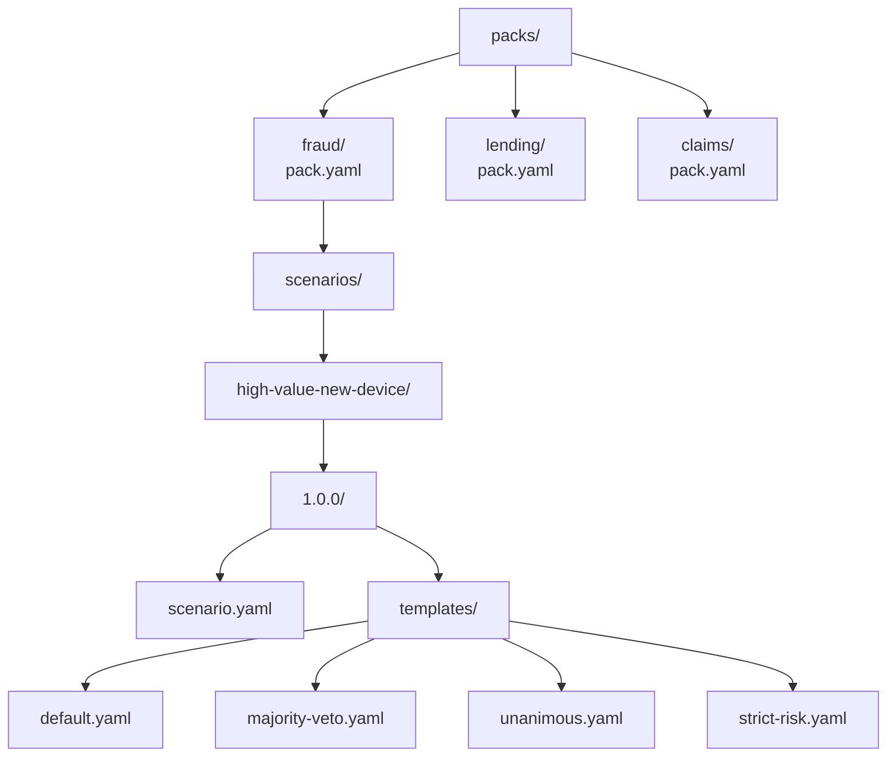
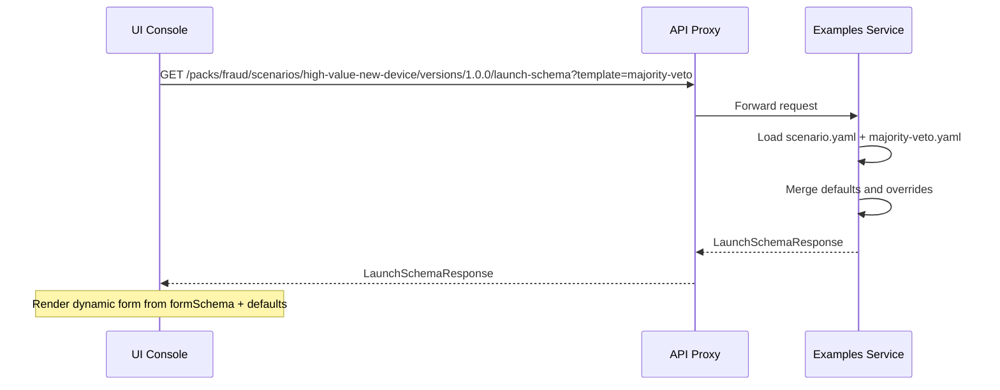
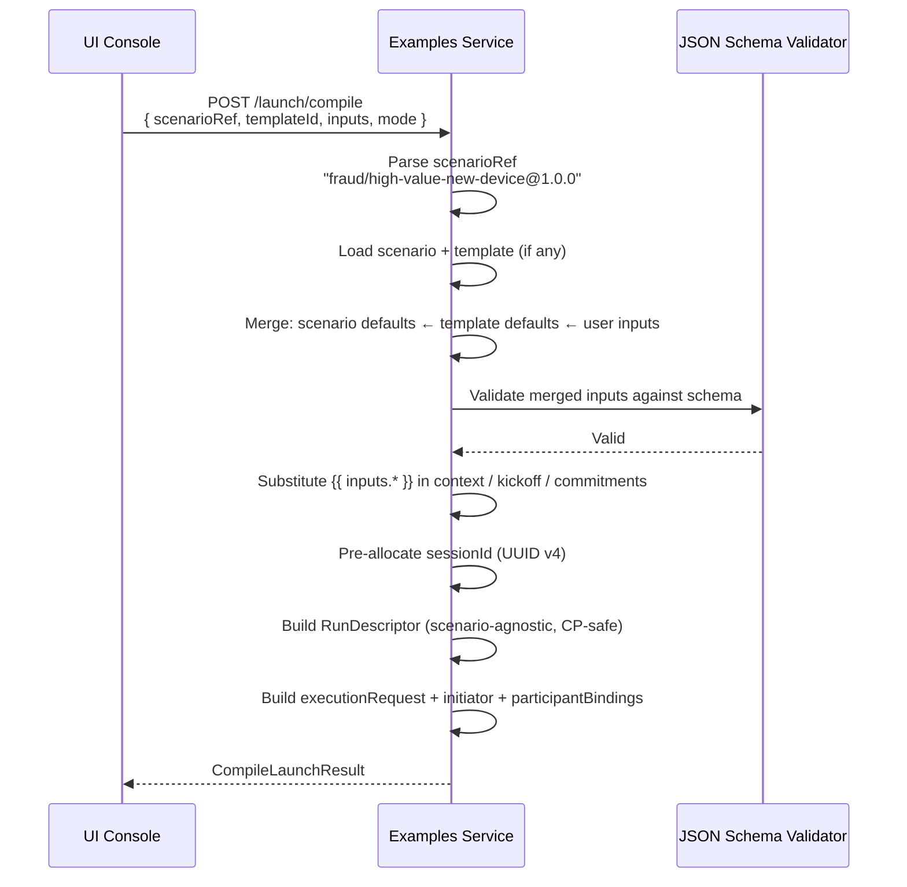
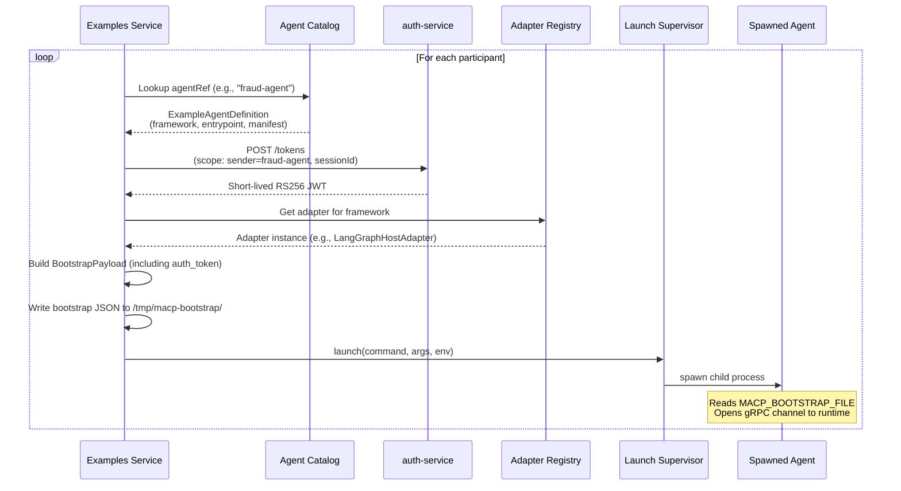
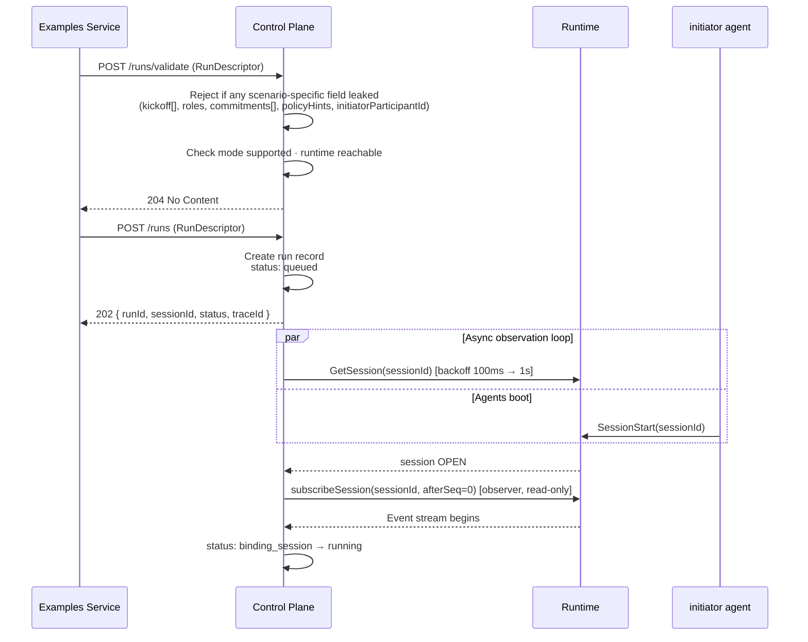
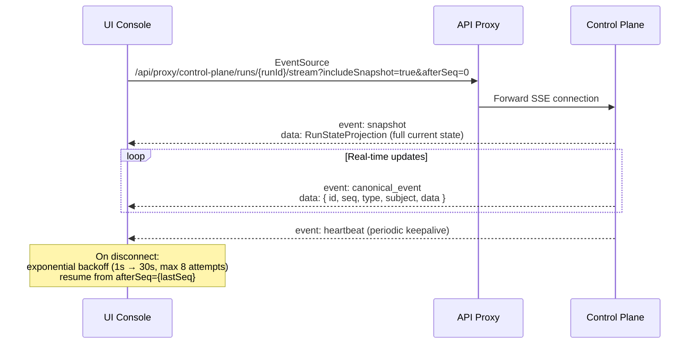

# UI Console & Examples Service Flow

> **Status:** Non-normative (explanatory).
>
> **Complements:** the protocol-level [MACP End-to-End Flow](https://multiagentcoordinationprotocol.io/docs/e2e-flow) for session creation, mode dispatch, policy evaluation, and replay — this doc is the product-layer view.

Imagine you are an operations analyst at a fintech company. A $2,400 purchase just came in from a brand-new device — the device trust score is a worrying 0.18 out of 1.0. The account is only two weeks old, but the customer has VIP status. Oh, and there is one prior chargeback on file. Should the transaction go through? Should it be blocked outright? Or should the system escalate to step-up verification?

This is not a question any single system can answer well on its own. It requires fraud expertise, growth strategy, compliance checks, and risk coordination — all working together, in real time, under governance rules that ensure no single voice dominates the outcome.

This document walks you through exactly how MACP makes that happen, from the moment an operator browses a scenario catalog in the UI Console, through agent bootstrapping in the Examples Service, all the way to live-streamed coordination results appearing in the browser. We use the **Fraud: High-Value New Device** scenario as our protagonist throughout — a single concrete story that illuminates every layer of the system.

---

## The Observer-Only Model (Read This First)

Before we trace the flow, one architectural invariant shapes everything downstream: **the Control Plane never writes envelopes on behalf of agents.**

Under [RFC-MACP-0004 §4](https://multiagentcoordinationprotocol.io/docs/security), the `sender` of any envelope must be derived from the caller's authenticated identity. That means each agent authenticates to the runtime **directly**, using its own per-agent Bearer token, and drives its own session participation over gRPC. The Control Plane's job is narrower than it used to be: create the run record, subscribe to the runtime's session stream as a read-only observer, normalize canonical events, and project them for the UI. It never calls `Send`. It never synthesizes a `SessionStart` on an agent's behalf. Three HTTP endpoints that used to let it do so — `POST /runs/:id/{messages,signal,context}` — now return `410 Gone`.

That invariant has four practical consequences you'll see throughout this doc:

1. **`POST /runs` accepts a whitelisted-safe `RunDescriptor` only.** Fields that describe scenario logic (`kickoff[]`, `participants[].role`, `commitments[]`, `policyHints`, `initiatorParticipantId`) are rejected with 400 if they appear in the request body. The Examples Service compiler is specifically shaped to produce Control-Plane-safe descriptors.
2. **The compiler produces twin artifacts.** One goes to the Control Plane (the scenario-agnostic `RunDescriptor`); the other goes to the spawned agents (the `executionRequest` + per-agent `bootstrap`). The `sessionId` is pre-allocated at compile time (UUID v4) and threaded into both.
3. **The initiator agent opens the session.** The risk agent in our fraud scenario calls `SessionStart(sessionId)` on the runtime using its own Bearer token. The Control Plane, meanwhile, is polling `GetSession(sessionId)` in a tight loop and subscribes read-only the moment the session transitions to `OPEN`.
4. **Cancellation is agent-bound by default.** When an operator clicks Cancel, the Control Plane POSTs to the initiator agent's `cancelCallback` URL (recorded in `run.metadata.cancelCallback`). The agent then calls `CancelSession` with its own identity. Policy-delegated cancellation (where the CP calls `CancelSession` directly) is available but requires the scenario's policy to grant cancel authority to the Control Plane.

Keep this invariant in mind as we walk through the flow — it explains a lot of design decisions that would otherwise look arbitrary.

---

## The Four Services (and Why No Single One Does Everything)

The journey from "I want to run a scenario" to "here's what the agents decided" crosses four services, each with a distinct job. No single service tries to do everything — that is by design.

The **UI Console** is the storefront where operators browse and launch. The **Examples Service** is the factory floor where scenarios become executable coordination requests and agents get spun up. The **Control Plane** is the observability nervous system that projects runtime events for the UI. And the **Runtime** is the protocol kernel where agents actually coordinate.



Notice how every call from the browser goes through a single API proxy route (`/api/proxy/{service}/{path}`). This is not just architectural tidiness — it means the UI Console never talks directly to backend services, which keeps authentication centralized and makes the whole thing deployable behind a single domain.

Here is what each service actually owns:

| Service | Responsibility |
|---------|---------------|
| **UI Console** | Scenario browsing, run configuration, live visualization, replay, export. All API calls go through a Next.js proxy route (`/api/proxy/{service}/{path}`) that injects auth headers. |
| **Examples Service** | Scenario catalog (file-based YAML), input validation, compilation into `RunDescriptor` + `executionRequest` + `initiator`, per-agent JWT minting, and agent process hosting. Does NOT embed the runtime. |
| **Control Plane** | Observer-only: create run records (queued → binding_session → running → completed), subscribe to runtime `StreamSession`, normalize and persist canonical events, project for the UI, SSE-stream to the browser. |
| **MACP Runtime** | Protocol enforcement, session state, mode dispatch, policy evaluation, event history. Agents authenticate directly; the Control Plane subscribes with an observer identity (`is_observer: true, can_start_sessions: false`). |

---

## The Scenario Catalog: YAML Files All the Way Down

The scenario catalog is deliberately low-tech — it is just YAML files on disk, organized in a hierarchy that mirrors how domain teams think. At the top level, **packs** group scenarios by business domain: fraud, lending, claims. Inside each pack, individual scenarios describe specific coordination situations. Each scenario can have multiple **versions** (because requirements evolve) and multiple **templates** (because the same scenario might run under different governance policies).

Why YAML files instead of a database? Because scenarios are authored by domain experts alongside their agent code, version-controlled in git, and reviewed in pull requests. The file system *is* the source of truth. The Examples Service simply reads it on startup.



### What a pack looks like

A pack is a thin wrapper — a slug, a human name, a description, and some tags for filtering:

```yaml
# packs/fraud/pack.yaml
apiVersion: scenarios.macp.dev/v1
kind: ScenarioPack
metadata:
  slug: fraud
  name: Fraud
  description: Fraud and risk decisioning demos
  tags: [fraud, risk, growth, demo]
```

### The scenario version: where things get interesting

Each scenario version is a complete, self-contained definition. This is where the real design thinking lives:

```yaml
# packs/fraud/scenarios/high-value-new-device/1.0.0/scenario.yaml
apiVersion: scenarios.macp.dev/v1
kind: ScenarioVersion
metadata:
  pack: fraud
  scenario: high-value-new-device
  version: 1.0.0
  name: High Value Purchase From New Device
spec:
  runtime:
    kind: rust
    version: v1

  inputs:
    schema:
      type: object
      properties:
        transactionAmount: { type: number, default: 2400, minimum: 1 }
        deviceTrustScore:  { type: number, default: 0.18, minimum: 0, maximum: 1 }
        # ... accountAgeDays, isVipCustomer, priorChargebacks
      required: [transactionAmount, deviceTrustScore, accountAgeDays, isVipCustomer, priorChargebacks]

  launch:
    modeName: macp.mode.decision.v1
    modeVersion: 1.0.0
    configurationVersion: config.default
    policyVersion: policy.default
    ttlMs: 300000
    initiatorParticipantId: risk-agent

    participants:
      - { id: fraud-agent,      role: fraud,      agentRef: fraud-agent }
      - { id: growth-agent,     role: growth,     agentRef: growth-agent }
      - { id: compliance-agent, role: compliance, agentRef: compliance-agent }
      - { id: risk-agent,       role: risk,       agentRef: risk-agent }

    contextTemplate:
      customerId: "{{ inputs.customerId }}"
      transactionAmount: "{{ inputs.transactionAmount }}"
      deviceTrustScore:  "{{ inputs.deviceTrustScore }}"

    kickoffTemplate:
      - from: risk-agent
        to: [fraud-agent, growth-agent, compliance-agent]
        messageType: Proposal
        payloadEnvelope:
          encoding: proto
          proto:
            typeName: macp.modes.decision.v1.ProposalPayload
            value:
              proposal_id: "{{ inputs.customerId }}-initial-review"
              option: evaluate_transaction
              rationale: Decide whether to approve, step_up, or decline.

    commitments:
      - id: fraud-risk-assessed
        title: Fraud risk assessed
        requiredRoles: [fraud]
        policyRef: policy.default
      - id: decision-finalized
        title: Decision finalized
        requiredRoles: [risk]

  outputs:
    expectedDecisionKinds: [approve, step_up, decline]
```

There is a lot packed in here. The `inputs.schema` is standard JSON Schema — it tells the UI exactly what form fields to render and how to validate them. The `launch` section defines coordination structure. The `contextTemplate` and `kickoffTemplate` use `{{ inputs.* }}` placeholders that get substituted at compile time with the operator's actual values. The `commitments[]` array declares the named coordination obligations — the Control Plane uses these to populate `PolicyProjection.expectedCommitments` at `binding_session` time so the UI can render the expected commitment list before the first evaluation fires.

The scenario author defines the *shape* of the coordination; the operator fills in the *specifics*.

### Templates: same scenario, different rules

Here is where MACP's separation of concerns really shines. The same fraud scenario can run under completely different governance policies just by swapping templates:

```yaml
# templates/majority-veto.yaml
apiVersion: scenarios.macp.dev/v1
kind: ScenarioTemplate
metadata:
  scenarioVersion: fraud/high-value-new-device@1.0.0
  slug: majority-veto
  name: Majority Vote with Veto
spec:
  defaults:
    transactionAmount: 2400
    deviceTrustScore:  0.18
    accountAgeDays:    14
    isVipCustomer:     true
    priorChargebacks:  1
  overrides:
    launch:
      policyVersion: policy.fraud.majority-veto
      policyHints:
        type: majority
        threshold: 0.5
        vetoEnabled: true
        vetoThreshold: 1
```

The template provides sensible defaults for the inputs and overrides the policy version. Same agents, same scenario structure, but the governance changes completely. You could also have a `unanimous.yaml` that requires all agents to agree, or a `strict-risk.yaml` that gives the risk agent unilateral authority. The coordination logic stays the same; only the rules change.

### How the UI discovers all of this

The UI Console fetches the catalog through three simple endpoints:

| Endpoint | Returns |
|----------|---------|
| `GET /packs` | All pack summaries |
| `GET /packs/{packSlug}/scenarios` | Scenarios in a single pack |
| `GET /scenarios` | Cross-pack listing with `packSlug`, `policyVersion`, `policyHints` per scenario |

No GraphQL schema to maintain, no complex query language — just HTTP endpoints that return the file tree as structured data.

---

## Configuring a Launch: From Browsing to "Run This"

The operator has found the fraud scenario and picked the majority-veto template. What happens next? The UI needs to show a configuration form — but it cannot hardcode one. Different scenarios have different inputs, different defaults, different participants. The form has to be generated dynamically.

This is where the **launch schema** comes in. When the operator selects a scenario and template, the UI fetches a complete description of everything that can be configured:



### The LaunchSchemaResponse

The response is designed so the UI can render a complete configuration page without any additional calls:

```ts
interface LaunchSchemaResponse {
  scenarioRef: string;               // "fraud/high-value-new-device@1.0.0"
  templateId?: string;               // "majority-veto"
  formSchema: Record<string, unknown>; // JSON Schema driving the form
  defaults: Record<string, unknown>;   // Pre-filled values
  participants: Array<{ id: string; role: string; agentRef: string }>;
  agents: ExampleAgentSummary[];
  runtime: { kind: string; version?: string };
  launchSummary: {
    modeName: string;
    modeVersion: string;
    configurationVersion: string;
    policyVersion?: string;
    policyHints?: { type?, threshold?, vetoEnabled?, ... };
    ttlMs: number;
    initiatorParticipantId?: string;
  };
  expectedDecisionKinds?: string[];
}
```

The `formSchema` is a standard JSON Schema — the UI does not need to know anything about fraud scenarios or transaction amounts, it just feeds the schema into a dynamic form renderer. The `defaults` come from the template merge (scenario defaults overlaid with template defaults), so the form comes pre-filled with realistic values. For our fraud scenario the operator sees `$2,400` already in the transaction amount field, `0.18` in the device trust score, and so on.

### What the operator sees

The Launch page (`/runs/new`) renders a rich configuration experience from this single response:

1. **Scenario selector** — pack + scenario + template pickers
2. **Input form** — generated from `formSchema`, pre-filled with `defaults`
3. **Execution mode** — `live` (real runtime) or `sandbox`
4. **Tags and metadata** — optional labels, actor ID, run label
5. **Participant summary** — read-only list of agents and their roles
6. **Launch summary** — mode, policy, TTL at a glance
7. **Input mode toggle** — switch between form view and a raw JSON editor

That last one is a nice touch. Domain experts use the form; power users who want to paste a modified payload flip to raw JSON. Same data, different interfaces.

---

## Compilation: Turning Intent Into Execution

The operator clicks "Launch." Now the compiler earns its keep.

The user's intent — "run this scenario with these inputs under this template" — needs to become **two** fully-resolved artifacts: a scenario-agnostic `RunDescriptor` that the Control Plane will accept, and a scenario-specific `executionRequest` + per-participant `initiator` payload that the spawned agents need to drive the session. Both are threaded with the same pre-allocated `sessionId` (UUID v4) so they can meet at the runtime.



### Variable substitution

The double-brace placeholders get replaced with the operator's actual input values:

```yaml
# Before substitution
proposal_id: "{{ inputs.customerId }}-initial-review"
transactionAmount: "{{ inputs.transactionAmount }}"

# After substitution (customerId = "CUST-1001", transactionAmount = 2400)
proposal_id: "CUST-1001-initial-review"
transactionAmount: 2400
```

### The compile result: twin artifacts

Here is what the compiler produces for our fraud scenario with the majority-veto template. Notice how it splits into distinct artifacts for distinct consumers:

```jsonc
{
  "sessionId": "7c7a8f4d-0d4d-4f2b-8a9e-1f3a6b2e0c11",

  // Scenario-agnostic, whitelisted-safe, handed to POST /runs
  "runDescriptor": {
    "mode": "live",
    "runtime": { "kind": "rust", "version": "v1" },
    "session": {
      "sessionId": "7c7a8f4d-0d4d-4f2b-8a9e-1f3a6b2e0c11",
      "modeName": "macp.mode.decision.v1",
      "modeVersion": "1.0.0",
      "configurationVersion": "config.default",
      "policyVersion": "policy.fraud.majority-veto",
      "ttlMs": 300000,
      "participants": [
        { "id": "fraud-agent" },
        { "id": "growth-agent" },
        { "id": "compliance-agent" },
        { "id": "risk-agent" }
      ],
      "metadata": {
        "source": "examples-service",
        "scenarioRef": "fraud/high-value-new-device@1.0.0",
        "templateId": "majority-veto",
        "cancelCallback": { "url": "http://risk-agent/cancel", "bearer": "…" }
      }
    },
    "execution": {
      "tags": ["example", "fraud", "demo"],
      "requester": { "actorId": "user@example.com", "actorType": "user" }
    }
  },

  // Initiator-only payload — the risk-agent uses this to call SessionStart
  "initiator": {
    "participantId": "risk-agent",
    "sessionStart": {
      "intent": "evaluate-transaction",
      "participants": ["fraud-agent","growth-agent","compliance-agent","risk-agent"],
      "ttlMs": 300000,
      "modeVersion": "1.0.0",
      "configurationVersion": "config.default",
      "policyVersion": "policy.fraud.majority-veto",
      "context": { "customerId": "CUST-1001", "transactionAmount": 2400, "deviceTrustScore": 0.18 }
    },
    "kickoff": {
      "messageType": "Proposal",
      "payload": {
        "proposalId": "CUST-1001-initial-review",
        "option": "evaluate_transaction",
        "rationale": "Decide whether to approve, step_up, or decline."
      }
    }
  },

  // Scenario-layer bookkeeping (roles, commitments, policyHints) retained for agent bootstraps
  "executionRequest": {
    "session": {
      "policyHints": { "type": "majority", "threshold": 0.5, "vetoEnabled": true, "vetoThreshold": 1 },
      "participants": [ /* full scenario-layer detail with role + metadata */ ],
      "commitments": [
        { "id": "fraud-risk-assessed", "title": "Fraud risk assessed", "requiredRoles": ["fraud"] },
        { "id": "decision-finalized",  "title": "Decision finalized",  "requiredRoles": ["risk"]  }
      ]
    }
  },

  "participantBindings": [
    { "participantId": "fraud-agent",      "role": "fraud",      "agentRef": "fraud-agent" },
    { "participantId": "growth-agent",     "role": "growth",     "agentRef": "growth-agent" },
    { "participantId": "compliance-agent", "role": "compliance", "agentRef": "compliance-agent" },
    { "participantId": "risk-agent",       "role": "risk",       "agentRef": "risk-agent" }
  ],

  "display": {
    "title": "High Value Purchase From New Device",
    "scenarioRef": "fraud/high-value-new-device@1.0.0",
    "templateId": "majority-veto",
    "expectedDecisionKinds": ["approve", "step_up", "decline"]
  }
}
```

A YAML scenario, a YAML template, and a handful of user inputs got merged, validated, substituted, and assembled into the twin artifacts. Every template variable has been replaced with a concrete value, the policy is set, the kickoff is ready, and the sessionId is allocated. The Control Plane gets a clean `runDescriptor`; the initiator gets its `SessionStart + kickoff`; every participant gets its slice of `executionRequest` via bootstrap.

---

## Agent Bootstrapping: Bringing the Participants to Life

Here is where things get physical. The compile result describes *what* should happen, but someone needs to actually spawn the agent processes that will participate in the coordination. When `bootstrapAgents: true` (the default for example runs), the Examples Service takes on this responsibility.

For each participant, the service looks up the agent definition, mints a per-agent JWT against the auth-service, writes a bootstrap file, and spawns a child process. The spawned agent reads the bootstrap, opens its own gRPC channel to the runtime, and begins participating.



### Framework adapters

MACP does not mandate a single agent framework. The fraud agent might be built with LangGraph, the growth agent with LangChain, the compliance agent with CrewAI, the risk agent with custom Node.js. They all participate in the same coordination session, speaking the same protocol, but their internal implementation is completely different.

| Framework | Adapter | Launch Command |
|-----------|---------|---------------|
| LangGraph | `LangGraphHostAdapter` | `python3 -m agents.langgraph_worker.main` |
| LangChain | `LangChainHostAdapter` | `python3 -m agents.langchain_worker.main` |
| CrewAI | `CrewAIHostAdapter` | `python3 -m agents.crewai_worker.main` |
| Custom | `CustomHostAdapter` | `node dist/example-agents/runtime/worker.js` |

### The BootstrapPayload

Each spawned agent receives a JSON file that contains everything it needs — who it is, which session it belongs to, where to connect, which JWT to present, and (for the initiator) what `SessionStart` + `kickoff` to emit:

```ts
// Canonical shape owned by the SDKs (macp-sdk-python, macp-sdk-typescript)
interface BootstrapPayload {
  participant_id: string;           // "fraud-agent" — this agent's sender identity
  session_id: string;               // UUID v4 — pre-allocated by the compiler
  mode: string;                     // "macp.mode.decision.v1"

  runtime_url: string;              // gRPC endpoint (e.g., "runtime.local:50051")
  auth_token: string;               // Per-agent Bearer JWT (RFC-MACP-0004 §4)
  secure?: boolean;                 // TLS flag
  allow_insecure?: boolean;         // Required when secure=false

  participants?: string[];          // All participant IDs in the session
  mode_version?: string;
  configuration_version?: string;
  policy_version?: string;

  // Present ONLY on the initiator's bootstrap — drives SessionStart + kickoff
  initiator?: {
    session_start: { intent, participants, ttlMs, context, ... };
    kickoff?: { messageType, payload };
  };

  // Set on the initiator when the scenario uses agent-bound cancellation (Option A)
  cancel_callback?: { host: string; port: number; path: string };

  // Examples-service–specific pass-through context (not consumed by the SDK)
  metadata?: {
    run_id: string;
    trace_id: string;
    scenario_ref: string;
    role: string;                   // "fraud" | "growth" | "compliance" | "risk"
    agent_ref: string;
    framework: string;
    policy_hints?: { ... };         // Denormalized for in-tree PolicyStrategy
    session_context?: Record<string, unknown>;  // Transaction inputs
  };
}
```

The file is written to `/tmp/macp-bootstrap/{session_id}_{participant_id}_{timestamp}.json` and the path is passed via the `MACP_BOOTSTRAP_FILE` environment variable. File-based handoff is intentional — it avoids command-line length limits, keeps secrets out of process arg lists, and makes debugging easy (you can `cat` the file to see what the agent received).

The SDK's `fromBootstrap()` / `from_bootstrap()` factory reads this file verbatim and wires up the MacpClient, session, and (for the initiator) the cancel-callback listener. See the SDK guides for field-by-field semantics:

- Python: [`macp-sdk` agent framework](https://github.com/multiagentcoordinationprotocol/python-sdk/blob/main/docs/guides/agent-framework.md)
- TypeScript: [`macp-sdk-typescript` agent framework](https://github.com/multiagentcoordinationprotocol/typescript-sdk/blob/main/docs/guides/agent-framework.md)

---

## The Fraud Decision: A Complete Story

Now we get to the good part. Everything we have built up to — the catalog, the compiler, the bootstrap system — comes together in a single, dramatic execution. Let's trace the complete lifecycle of our fraud scenario, moment by moment.

### Setting the scene

Remember our transaction: $2,400 from a new device (trust score 0.18) on a 14-day-old VIP account with one prior chargeback. Four specialist agents are about to debate what to do about it.

### The cast of characters

Each agent brings a different perspective, uses a different framework, and has fundamentally different priorities. That tension is the whole point — coordination is only interesting when the participants disagree.

| Agent | Role | Framework | Responsibility |
|-------|------|-----------|---------------|
| `risk-agent` | Risk (Initiator) | Custom/Node.js | Opens the session · sends the initial proposal · issues the final Commitment |
| `fraud-agent` | Fraud | LangGraph | Evaluates device trust, chargeback history, identity-risk signals |
| `growth-agent` | Growth | LangChain | Assesses customer lifetime value, revenue impact, VIP status |
| `compliance-agent` | Compliance | CrewAI | Applies KYC/AML checks, policy rules, regulatory requirements |

### The full execution: six phases of a coordinated decision

This is the sequence that plays out in real time, with events streaming to the operator's browser as they happen. Pay attention to who calls whom — under the observer-only model, agents drive the session; the Control Plane just watches.

```mermaid
sequenceDiagram
    participant UI as UI Console
    participant ES as Examples Service
    participant CP as Control Plane
    participant RT as Runtime
    participant Risk as risk-agent
    participant Fraud as fraud-agent
    participant Growth as growth-agent
    participant Comp as compliance-agent

    Note over UI,Comp: Phase 1 — Launch (synchronous for the operator)
    UI->>ES: POST /examples/run<br/>{ scenarioRef, templateId, inputs, bootstrapAgents: true }
    ES->>ES: Compile → RunDescriptor + executionRequest + initiator + sessionId
    ES->>CP: POST /runs/validate (RunDescriptor)
    CP-->>ES: 204 Valid
    ES->>CP: POST /runs (RunDescriptor)
    CP-->>ES: { runId, sessionId, status: "queued", traceId }
    ES->>ES: Mint 4 per-agent JWTs · write bootstrap files · spawn 4 processes
    ES-->>UI: { compiled, hostedAgents[], sessionId }
    UI->>UI: Navigate to /runs/live/{sessionId}

    Note over UI,Comp: Phase 2 — Session Creation (agents drive; CP observes)
    CP->>RT: GetSession(sessionId)  [polls until OPEN]
    Risk->>RT: SessionStart(sessionId) [gRPC · risk-agent's JWT]
    RT-->>Risk: Ack · session OPEN
    Risk->>RT: Proposal envelope (kickoff)
    CP->>RT: subscribeSession(sessionId, afterSeq=0) [observer]
    RT-->>CP: Replay: SessionStart + Proposal
    CP-->>UI: SSE snapshot + canonical_events

    Note over UI,Comp: Phase 3 — Specialist Evaluation
    Fraud->>RT: Evaluation  (recommendation: BLOCK, confidence: 0.85)
    Growth->>RT: Evaluation (recommendation: APPROVE, confidence: 0.72)
    Comp->>RT: Evaluation   (recommendation: REVIEW, confidence: 0.68)
    RT-->>CP: Observed envelopes
    CP-->>UI: SSE canonical_events

    Note over UI,Comp: Phase 4 — Objection
    Fraud->>RT: Objection (severity: critical, "Device trust 0.18 below threshold")
    RT-->>CP: Observed
    CP-->>UI: SSE canonical_event

    Note over UI,Comp: Phase 5 — Voting
    Fraud->>RT: Vote REJECT on "approve"
    Growth->>RT: Vote APPROVE on "approve"
    Comp->>RT: Vote ABSTAIN
    RT-->>CP: Observed
    CP-->>UI: SSE canonical_events

    Note over UI,Comp: Phase 6 — Commitment
    Risk->>RT: Commitment (action: "step_up", reason: "Critical objection from fraud; majority did not approve")
    RT->>RT: Evaluate against majority-veto policy<br/>critical objection present → veto honoured
    RT->>RT: Session → RESOLVED
    RT-->>CP: session.state.changed
    CP-->>UI: SSE session.state.changed + run.completed

    Note over UI: Decision panel renders "step_up" with full breakdown
```

Let's walk through what just happened.

**Phase 1 — Launch.** The operator clicks "Run." The Examples Service compiles the scenario into the twin artifacts, validates the `RunDescriptor` with the Control Plane (a dry run — is the mode supported? runtime reachable?), then creates the run record. The Control Plane returns immediately (202) with `runId`, `sessionId`, and `traceId`. The Examples Service mints four per-agent JWTs against the auth-service, writes four bootstrap files, and spawns four processes. The UI navigates to the live workbench. Total wall time: a couple of seconds.

**Phase 2 — Session Creation.** The Control Plane enters its async observation loop: it polls `GetSession(sessionId)` on the runtime with an exponential backoff (100ms → 1s). Meanwhile, the risk-agent's worker starts up, reads its bootstrap, opens a gRPC channel with its own JWT, and calls `SessionStart(sessionId)`. The runtime accepts the call (risk-agent is the whitelisted initiator), creates the session, and enters `OPEN` state. Risk-agent immediately sends its kickoff `Proposal` envelope. The Control Plane's poll finally sees `OPEN`, opens a read-only `subscribeSession`, and receives a replay of the `SessionStart` + `Proposal` envelopes — which it normalizes and projects for the UI. The UI sees its first `snapshot` frame over SSE.

**Phase 3 — Specialist Evaluation.** This is where it gets interesting. The three specialist agents analyze the transaction independently and arrive at different conclusions. The fraud agent sees the low device trust score and the prior chargeback and recommends BLOCK with 85% confidence. The growth agent sees the VIP status and high lifetime value and recommends APPROVE with 72% confidence. The compliance agent finishes its KYC checks but notes a pending AML flag and recommends REVIEW with 68% confidence. Three agents, three different answers — exactly the kind of disagreement that coordination protocols are designed to resolve.

**Phase 4 — Objection.** The fraud agent is not done. It files a formal objection with *critical* severity, citing the device trust score of 0.18 as below threshold. Under the majority-veto policy, a critical objection can trigger a veto. The fraud agent is essentially saying: "I feel strongly enough about this that I'm willing to block the entire decision."

**Phase 5 — Voting.** The agents cast their votes on the "approve" option. Fraud votes REJECT. Growth votes APPROVE. Compliance abstains. The tally: 1 approve, 1 reject, 1 abstain. No majority either way.

**Phase 6 — Commitment.** The risk agent, as the initiator, reads the room. No majority approved. There is a critical objection from fraud. The risk agent commits to `step_up` — escalating to additional verification. The runtime evaluates this commitment against the majority-veto policy, honours the veto, and transitions the session to `RESOLVED`. The Control Plane's observer stream catches the `session.state.changed` frame and fans out the final canonical events to the UI.

### How the policy evaluation works

At commitment time, the runtime's policy evaluator asks three questions under majority-veto:

1. **Majority check** — did more than 50% vote APPROVE? (1 approve, 1 reject, 1 abstain — no majority)
2. **Veto check** — any critical-severity objection present? (Yes, from fraud-agent — veto triggers)
3. **Action admissibility** — the expected decision kinds are `approve`, `step_up`, `decline`; the initiator's `step_up` commitment is permitted as a middle-ground outcome when the group couldn't approve and there's a credible fraud signal

Decision: `step_up`. Session transitions to `RESOLVED`. The operator sees the decision panel update with "step_up" and a full breakdown of why — which agents voted how, what objections were raised, and how the policy evaluated the commitment.

---

## Submitting to the Control Plane (the handoff)

After compilation and bootstrap prep, the Examples Service has to actually create the run record before agents can start. This is the only HTTP call that creates state; everything else is observation. Keep this section focused on the handoff — for the protocol-level details of what happens inside the runtime, see the [MACP End-to-End Flow](https://multiagentcoordinationprotocol.io/docs/e2e-flow).



Two-step submission: **validate first, then create**. The validation step (`POST /runs/validate`) is a dry run — it checks that the requested mode is supported, the runtime is reachable, and the request is well-formed. Only after it passes does the Examples Service create the run. This prevents wasted agent bootstrapping when the Control Plane is not ready.

The control plane returns `202 Accepted` with the handle:

```json
{
  "runId": "a1b2c3d4-…",
  "sessionId": "7c7a8f4d-0d4d-4f2b-8a9e-1f3a6b2e0c11",
  "status": "queued",
  "traceId": "trace-xyz-123"
}
```

The UI Console uses the `runId` (= `sessionId` under the current observer-only rollout) to navigate to the live workbench and open an SSE stream. From this point on, the operator is watching the coordination unfold in real time.

---

## Live Streaming: Real-Time Visibility Into Coordination

The operator is now sitting at the live workbench, watching events roll in. How does that actually work?

The UI Console maintains a persistent **Server-Sent Events (SSE)** connection to the Control Plane. SSE was chosen over WebSockets deliberately — it is simpler, works through more proxies and load balancers, and the data flow is one-directional (server to client), which is exactly what we need.



### Three event types, and that is all you need

| Event | Payload | When |
|-------|---------|------|
| `snapshot` | Full `RunStateProjection` | On initial connect and reconnection |
| `canonical_event` | Single `CanonicalEvent` | Each time a new event is processed |
| `heartbeat` | Empty | Periodic keepalive |

The `snapshot` event is the key to resilient streaming. When you first connect (or reconnect after a network blip), you get the complete current state of the run — not just the events you missed, but the fully projected state. This means the UI can render correctly immediately, without replaying event history client-side.

### Connection management

The `useLiveRun` hook handles real-world network nastiness:

- **Buffer limit** — keeps the last 500 events in memory; older events trimmed
- **Heartbeat timeout** — if no heartbeat received within 45 seconds, treats as connection failure
- **Reconnection** — exponential backoff: 1s → 2s → 4s → 8s → … up to 30s, max 8 attempts
- **Resumption** — on reconnect, passes `afterSeq={lastSeq}` so the server skips events already delivered
- **Status tracking** — `idle` → `connecting` → `live` → `reconnecting` → `ended` or `error`

Each canonical event carries a monotonically increasing sequence number. When the connection drops and the client reconnects, it tells the server "I have already seen events up to sequence N — start from N+1." No duplicates, no gaps, no reconciliation.

### Canonical event vocabulary

As the coordination plays out, these are the event types the UI receives and renders:

| Category | Event Types |
|----------|------------|
| Run lifecycle | `run.created`, `run.started`, `run.completed`, `run.failed`, `run.cancelled` |
| Session | `session.bound`, `session.stream.opened`, `session.state.changed` |
| Participants | `participant.seen` |
| Messages | `message.received`, `message.send_failed` |
| Signals | `signal.emitted`, `signal.acknowledged` |
| Coordination | `proposal.created`, `proposal.updated`, `decision.finalized` |
| Policy | `policy.resolved`, `policy.commitment.evaluated`, `policy.denied` |
| LLM | `llm.call.completed` (synthesized from agent-carried token metadata) |

---

## The Live Workbench: Making Coordination Visible

Events are streaming in. Now the UI needs to turn that stream into something an operator can actually understand. The live workbench (`/runs/live/{runId}`) is a multi-panel view that provides real-time visibility into every aspect of the coordination.

### The execution graph

The centrepiece is an interactive directed graph built with React Flow. It transforms the abstract concept of "four agents coordinating under a policy" into something you can see and interact with:

- **Node types** — Start (flag), Context (database), Agent (bot), Decision (workflow), Output (check)
- **Edges** — animated by kind: kickoff, message, proposal
- **Layout** — auto-positioned columns: start → context → agents → decision → output
- **Live updates** — nodes update status, progress bars, and signal badges as SSE events arrive

In our fraud scenario, you would see the risk agent node pulse as it sends the kickoff, then the three specialist nodes light up as they submit evaluations, then a critical objection badge appears on the fraud agent, and finally the decision node resolves to "step_up" with the full confidence breakdown.

### The supporting panels

| Panel | Data Source | What It Shows |
|-------|------------|---------------|
| **Live Event Feed** | `events[]` | Reverse-chronological list — type, seq, timestamp, source, subject, one-line summary |
| **Decision Panel** | `state.decision` | Current action, confidence, finalized flag, contributors, outcome polarity |
| **Policy Panel** | `state.policy` | Policy version, expected commitments, vote tally, quorum status, per-commitment evaluations |
| **Signal Rail** | `state.signals` | Side-channel signals — name, timestamp, source, confidence, severity |
| **Node Inspector** | Selected node | Per-participant deep dive — overview, payloads, logs, traces/artifacts, LLM calls |

Under the observer-only model, the workbench is fully **read-only** — the message / signal / context input forms that used to live here are gone. Agents drive envelopes via their SDKs; the workbench consumes state.

### The single source of truth: RunStateProjection

All panels render from one projection that the Control Plane builds incrementally from the event stream:

```ts
interface RunStateProjection {
  run: RunSummaryProjection;                 // + contextId, extensionKeys
  participants: ParticipantProjection[];
  graph: GraphProjection;                    // React Flow nodes/edges
  decision: DecisionProjection;              // action, confidence, reasons, proposals[], resolvedAt/By, prompt
  signals: SignalProjection;
  progress: ProgressProjection;
  timeline: TimelineProjection;
  trace: TraceSummary;
  outboundMessages: OutboundMessageSummary;
  policy?: PolicyProjection;                 // expectedCommitments, voteTally, quorumStatus, evaluations
  llm?: { calls[], totals: { callCount, promptTokens, completionTokens, totalTokens, estimatedCostUsd } };
}
```

One projection, many views. When a new canonical event arrives, the projection updates and every panel re-renders from the same data.

---

## After the Decision: Replay, Compare, and Learn

The coordination is complete. Our fraud scenario resolved to `step_up`. But the story does not end when the session closes — in many ways, that is where the most valuable work begins. Understanding *why* agents reached a particular decision, comparing outcomes across different policy configurations, and debugging unexpected behavior all happen post-execution.

### Replay

The Control Plane supports three replay modes, each designed for a different use case:

| Mode | Behavior |
|------|----------|
| `timed` | Events replayed with proportional inter-event timing; speed multiplier (0.5x–4x) |
| `step` | Events emitted one at a time on request |
| `instant` | All events emitted immediately |

The **Timeline Scrubber** component renders a range slider with discrete frame markers. Scrubbing loads the `RunStateProjection` at a specific sequence number via `GET /runs/{runId}/replay/state?seq=N`, allowing the operator to rewind to any point in the coordination.

Think of it like a DVR for coordination. You can watch the fraud scenario play out at 2x speed, pause at the moment the fraud agent filed its critical objection, inspect the state of every participant at that instant, then step forward one event at a time to see how the objection changed the outcome. This is extraordinarily useful for understanding policy behaviour — "what would have happened if the fraud agent had filed a warning instead of a critical objection?"

### Run comparison

The comparison view at `/runs/{leftId}/compare/{rightId}` puts two runs next to each other and highlights the differences:

- **Decision delta** — what each run decided and why
- **Payload diff** — JSON diff of RunDescriptors and outcomes
- **Timeline alignment** — events mapped by type across both runs
- **Participant comparison** — per-agent activity and signal differences

This is how you answer questions like: "We ran the same fraud scenario with the majority-veto template and the unanimous template — how did the outcomes differ?"

### Export and clone

- **Export bundle** — download the complete run as a JSON archive (events, projection, metrics, traces)
- **Clone run** — re-launch with the same `RunDescriptor` but optional `tags` overrides (non-empty `context` overrides are rejected by the CP under observer-only rules)
- **Archive** — mark run as archived for cleanup

The clone feature is particularly useful for iterative testing. You run a scenario, see the outcome, tweak one input parameter, clone with overrides, and compare. Rinse and repeat until the agents and policies behave the way you want.

---

## When Things Go Wrong: Error Handling Across the Stack

Production systems fail. Networks partition. Agents crash. Inputs get malformed. A system that only works on the happy path is not a system — it is a demo. MACP handles errors at every layer with structured codes and clear feedback that flows all the way back to the operator.

### Examples Service errors

These are the errors you hit before the run even starts — bad scenario references, invalid inputs, unreachable dependencies:

| Code | HTTP | When |
|------|------|------|
| `PACK_NOT_FOUND` | 404 | Pack slug doesn't match any `pack.yaml` |
| `SCENARIO_NOT_FOUND` | 404 | Scenario slug not found in pack |
| `VERSION_NOT_FOUND` | 404 | Requested version doesn't exist |
| `TEMPLATE_NOT_FOUND` | 404 | Template slug not found for version |
| `AGENT_NOT_FOUND` | 404 | `agentRef` doesn't match the catalog |
| `INVALID_SCENARIO_REF` | 400 | Ref format invalid (expected `pack/scenario@version`) |
| `VALIDATION_ERROR` | 400 | User inputs fail JSON schema validation |
| `COMPILATION_ERROR` | 400 | Template substitution or merge failure |
| `AUTH_MINT_FAILED` | 502 | Per-agent JWT mint against the auth-service failed |
| `CONTROL_PLANE_UNAVAILABLE` | 502 | Cannot reach the Control Plane for validate/create |
| `INVALID_CONFIG` | 500 | Required env var missing at boot (e.g. `MACP_AUTH_SERVICE_URL`) |

### Control Plane errors

These happen during execution — runtime connectivity issues, rejected requests, policy enforcement:

| Code | When |
|------|------|
| `ENDPOINT_REMOVED` | Request hit one of the 410 Gone endpoints (`/runs/:id/{messages,signal,context}`) |
| `RUN_NOT_FOUND` | Run ID doesn't exist |
| `INVALID_STATE_TRANSITION` | Attempted transition not allowed (e.g. cancel on completed run) |
| `RUNTIME_UNAVAILABLE` | Cannot connect to runtime |
| `CIRCUIT_BREAKER_OPEN` | Circuit breaker tripped after consecutive gRPC failures |
| `UNKNOWN_POLICY_VERSION` | Requested `policyVersion` not registered with runtime |
| `POLICY_DENIED` | Commitment rejected by governance rules (includes structured `reasons`) |
| `INVALID_POLICY_DEFINITION` | Registered policy rules fail schema validation |

### UI Console error handling

The UI handles errors at multiple levels, because failures can happen anywhere in the stack:

- **API errors** — `lib/api/fetcher.ts` throws `ApiError` with `status`, `statusText`, `service`, `path`. Components check `isNotFound` for 404-specific handling; non-404 errors propagate.
- **React Error Boundaries** — catch render errors with fallback UI and a "Try again" button.
- **Query errors** — TanStack React Query retries once, then renders `ErrorPanel` with action links.
- **SSE failures** — the connection status badge shows `reconnecting` with attempt counter; after 8 failed attempts, it shows `error` status with a manual retry option.

### Agent process errors

Even agent crashes are handled gracefully:

- The `LaunchSupervisor` captures stdout/stderr from spawned agents with prefix `[{framework}:{participantId}:{sessionId}]`.
- Agent crash is detected via the process exit handler; the `HostedExampleAgent` status reflects the failure.
- Bootstrap file cleanup runs automatically on process exit.
- If the initiator crashes before calling `SessionStart`, the Control Plane's `pollForOpenSession` loop times out and the run transitions to `failed` with a `KICKOFF_FAILED` cause.

The key principle throughout: errors are structured, codes are specific, and the operator always has enough context to understand what went wrong and what to try next. A `POLICY_DENIED` error does not just say "something failed" — it tells you which policy rule rejected which commitment and why. That is the difference between an error message that helps and one that wastes your time.
